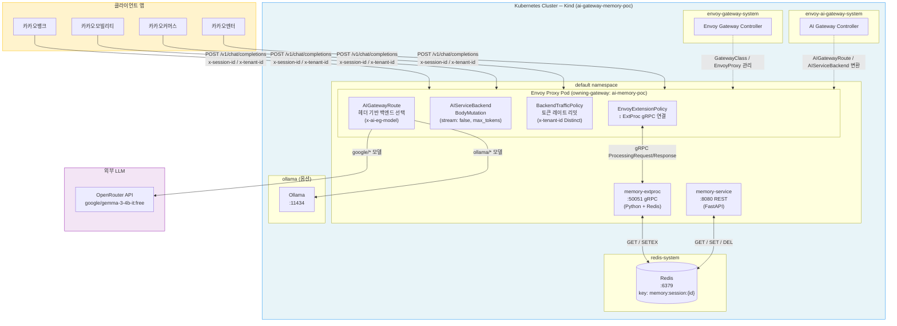
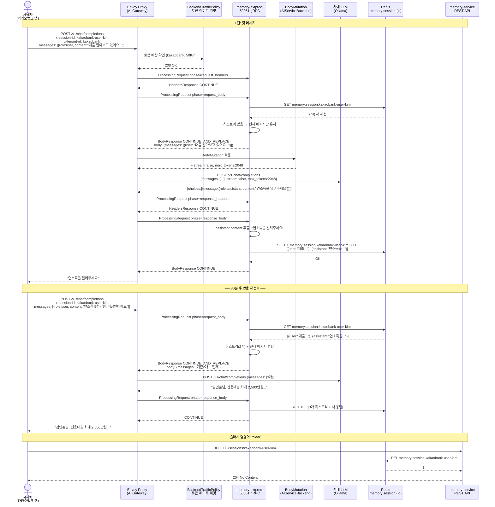
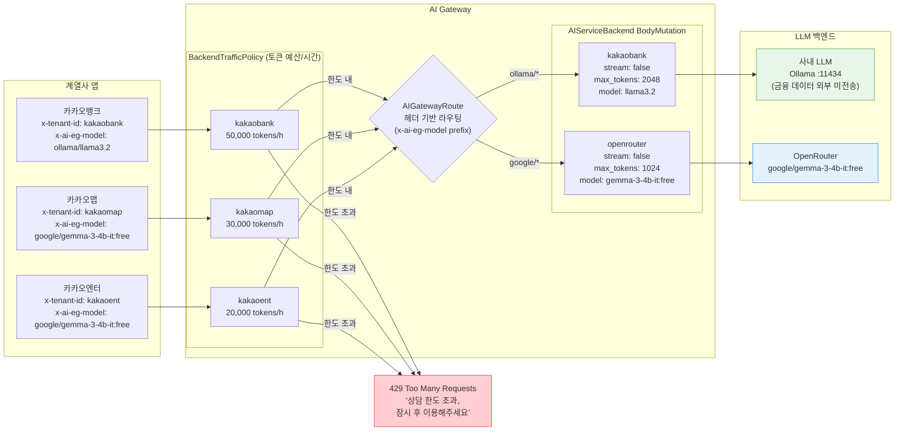
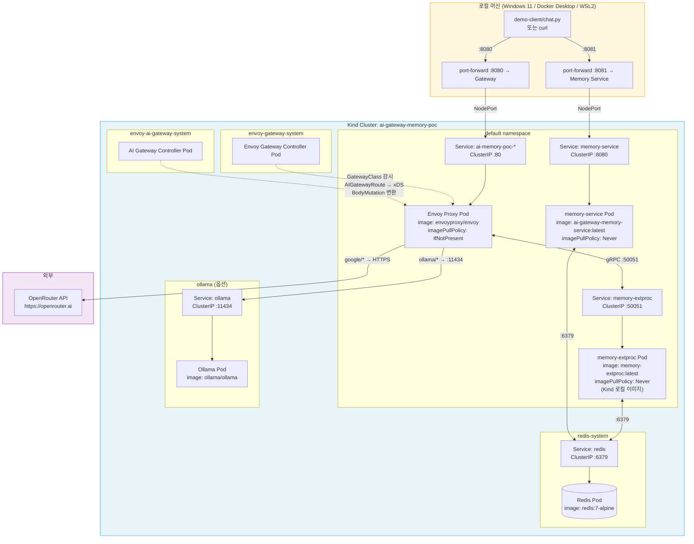
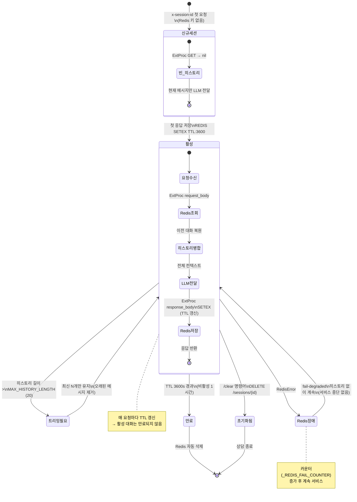
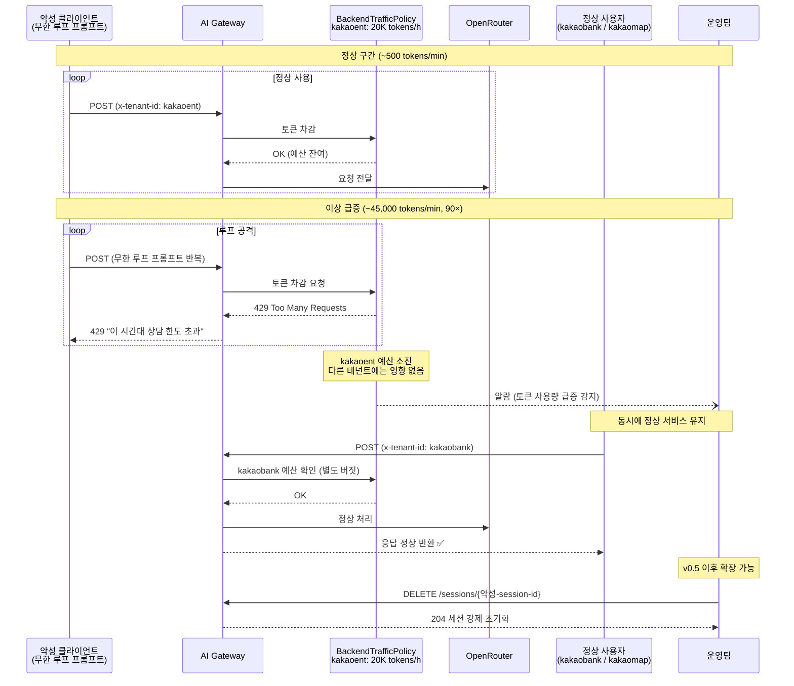
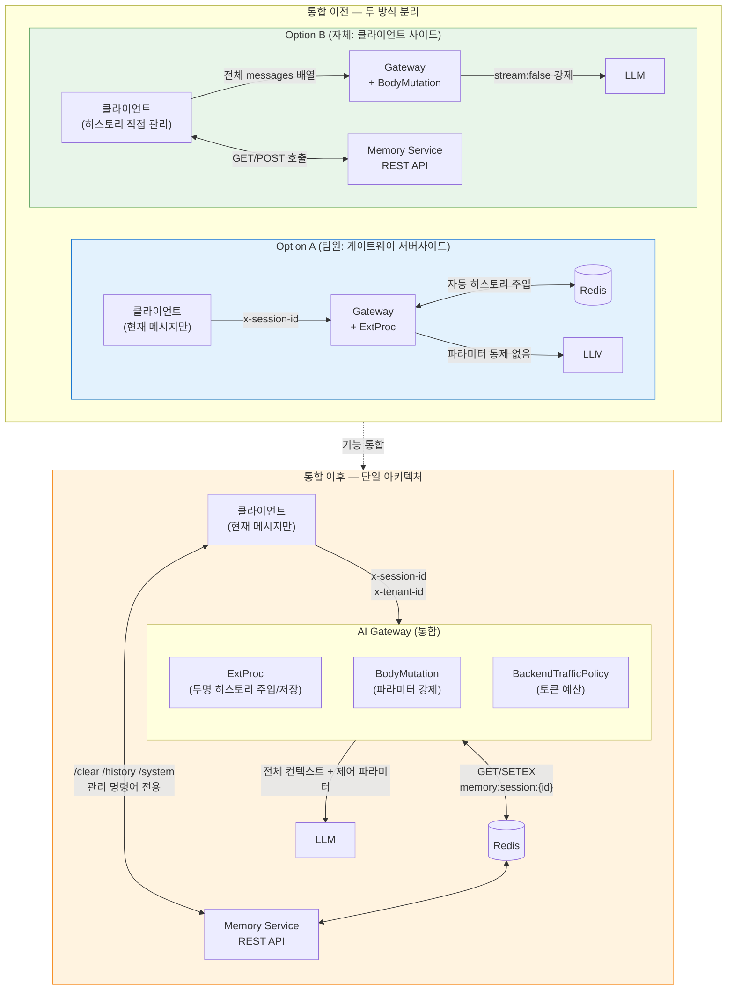

# AI Gateway Memory PoC — 아키텍처 다이어그램

> Envoy AI Gateway v0.5 + ExtProc 메모리 + BodyMutation + 멀티테넌트 토큰 제어  
> 각 다이어그램은 독립적으로 읽을 수 있습니다.

---

## 1. 시스템 컴포넌트 다이어그램

전체 구성 요소와 역할, 네임스페이스 경계를 보여줍니다.



---

## 2. 요청 처리 시퀀스 다이어그램

카카오뱅크 사용자의 대출 상담 2턴 예시 — 메모리가 작동하는 전체 흐름입니다.



---

## 3. ExtProc 처리 플로우차트

`memory-extproc`이 각 phase에서 내리는 결정과 에러 처리 전략입니다.

```mermaid
flowchart TD
    START([ProcessingRequest 수신]) --> PHASE{Phase?}

    PHASE -->|request_headers| RH_EXTRACT[x-session-id 헤더 추출]
    RH_EXTRACT --> RH_CHECK{세션 ID 있음?}
    RH_CHECK -->|없음| RH_FAIL[즉시 응답\n400 Bad Request\nfail-closed]
    RH_CHECK -->|있음| RH_STORE[세션 ID 저장\nContent-Type 저장]
    RH_STORE --> RH_CONT([CONTINUE])

    PHASE -->|request_body| RB_PARSE[JSON body 파싱]
    RB_PARSE --> RB_CHECK{파싱 성공?}
    RB_CHECK -->|실패| RB_PASS([원본 body 통과\nfail-open])
    RB_CHECK -->|성공| RB_REDIS[Redis 히스토리 조회\nGET memory:session:{id}]
    RB_REDIS --> RB_REDIS_CHK{Redis 응답?}
    RB_REDIS_CHK -->|RedisError| RB_DEGRADE[히스토리 없이 계속\nfail-degraded\n카운터 증가]
    RB_REDIS_CHK -->|nil 새 세션| RB_EMPTY[빈 히스토리]
    RB_REDIS_CHK -->|JSON 데이터| RB_DECODE[히스토리 파싱\n유효성 검증]
    RB_DECODE --> RB_MERGE
    RB_EMPTY --> RB_MERGE
    RB_DEGRADE --> RB_MERGE
    RB_MERGE[히스토리 + 현재 메시지 병합] --> RB_TRIM[MAX_HISTORY_LENGTH 트리밍\n최신 N개 유지]
    RB_TRIM --> RB_REPLACE([body 교체\nCONTINUE_AND_REPLACE])

    PHASE -->|response_headers| RSP_HDR[Content-Type 저장\nSSE 여부 플래그]
    RSP_HDR --> RSP_CONT([CONTINUE])

    PHASE -->|response_body| RSP_SSE{Content-Type 또는\nbody prefix가 SSE?}
    RSP_SSE -->|data: / event: / id:| SSE_SKIP([스트리밍 pass-through\n저장 스킵])
    RSP_SSE -->|아니오| RSP_PARSE[JSON 파싱]
    RSP_PARSE --> RSP_EXTRACT[choices 순회\nassistant role 추출]
    RSP_EXTRACT --> RSP_FOUND{assistant content\n있음?}
    RSP_FOUND -->|없음| RSP_SKIP([저장 스킵 CONTINUE])
    RSP_FOUND -->|있음| RSP_APPEND[히스토리에 assistant 메시지 추가]
    RSP_APPEND --> RSP_SAVE[Redis SETEX\nTTL: 3600s]
    RSP_SAVE --> RSP_REDIS_CHK{저장 성공?}
    RSP_REDIS_CHK -->|실패| RSP_WARN[경고 로그\n카운터 증가]
    RSP_REDIS_CHK -->|성공| RSP_OK
    RSP_WARN --> RSP_OK([CONTINUE])

    style RH_FAIL fill:#ffcdd2,stroke:#f44336
    style RB_PASS fill:#fff9c4,stroke:#fbc02d
    style RB_DEGRADE fill:#fff9c4,stroke:#fbc02d
    style SSE_SKIP fill:#e8eaf6,stroke:#5c6bc0
```

---

## 4. 멀티테넌트 라우팅 다이어그램

테넌트별 토큰 예산, LLM 선택, BodyMutation 파라미터 적용 흐름입니다.



---

## 5. K8s 배포 다이어그램

Kind 클러스터 내 실제 Pod 배치와 네트워크 연결입니다.



---

## 6. 세션 생명주기 상태 다이어그램

하나의 대화 세션이 생성되어 소멸될 때까지의 상태 변화입니다.



---

## 7. 이상 사용 탐지 시나리오 다이어그램

`kakaoent` 테넌트에서 토큰 급증이 발생했을 때의 처리 흐름입니다.



---

## 8. Option A + B 통합 전후 비교

두 구현 방식을 통합하기 전후의 아키텍처 차이입니다.



---

*생성일: 2026-04-28 | 프로젝트: Envoy AI Gateway Memory PoC (v0.5)*
